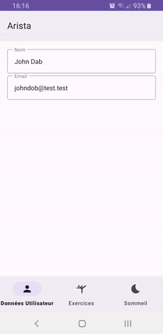
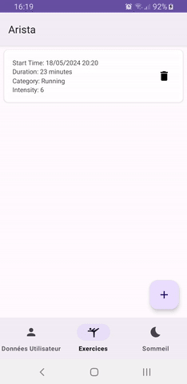
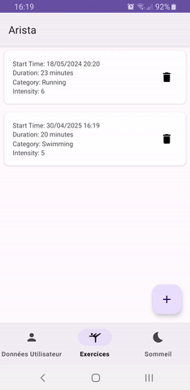

  

# Arista App

Arista est une application destinée à suivre les données personnelles de l'utilisateur telles que les exercices physiques et les cycles de sommeil.
Application Android  **100% hors-ligne** avec persistance locale via Room.
Développée en Kotlin avec une architecture **Clean + MVVM**, en respectant les bonnes pratiques Android modernes.

---

## 🚀 Présentation du projet

**Contexte** :  
Dans un environnement sans connexion réseau, il est essentiel d’offrir une **expérience fluide et fiable hors-ligne**. Ce projet illustre la mise en place d'une **base locale Room** dans une application Android existante, avec un code maintenable, testé et bien structuré.

**Mission** :  
- Intégrer une base de données **Room** respectant les principes de **Clean Architecture**.
- Pré-remplir certaines données au démarrage (Utilisateur, Sommeil).
- Permettre l’ajout et la suppression d'exercices.
- Garantir une séparation des responsabilités (Entity, Domain, UI).
- Rédiger des **tests unitaires** pour les use cases et les ViewModels.

---

## ⚙️ Fonctionnalités principales

- Enregistrement des exercices physiques de l'utilisateur : durée, intensité, catégorie.
- Suivi du sommeil : heure de début, durée, qualité du sommeil.
- Profil utilisateur : informations personnelles comme le nom, l'email, le mot de passe.
- **Pré-remplissage** automatique de l’utilisateur et des données de sommeil.
- **Ajout et suppression** d’exercices depuis le fragment correspondant.
- Gestion de la base via **Room** avec DAO, entities, et callbacks.
- **Architecture Clean** : couche `data`, `domain`, `presentation`.
- **Mappers** entre les entités Room et les modèles de domaine.
- **Injection de dépendances** avec Hilt.
- **Gestion asynchrone** avec Coroutines.
- **Tests unitaires** sur les UseCases et ViewModels.

---

## 📈 Tâches réalisées

| Étape | Objectifs | Résultats |
| :--- | :--- | :--- |
| **Ajout de Room** | Intégration d’une base locale fiable | Room intégré et fonctionnel |
| **Pré-remplissage** | Remplir la DB à la première ouverture | Utilisateur et sommeil insérés |
| **DAOs & Entities** | Créer les couches d’accès à la DB | Entités bien séparées du domaine |
| **Clean Architecture** | Séparation stricte des responsabilités | Structure modulaire et testable |
| **UI & ViewModels** | Collecte des données via Flows | Interaction fluide entre couches |
| **Tests unitaires** | Sécurisation des traitements | UseCases et logique testés |

---

## 🛠️ Stack technique

- **Langage** : Kotlin
- **UI** : Jetpack Compose
- **Base de données** : Room
- **Architecture** : Clean Architecture + MVVM
- **Injection** : Hilt
- **Asynchrone** : Kotlin Coroutines / Dispatchers.IO
- **Données** : 100% locale (aucun appel réseau)
- **Tests** : JUnit, MockK
- **IDE** : Android Studio Giraffe

---

## Pré-requis
- Android Studio
- SDK Android
  

---

## Utilisation
- Profil utilisateur : Enregistrez vos données personnelles.
- Exercices : Ajoutez vos exercices en cliquant sur le bouton "Ajouter" et en remplissant les informations nécessaires.
- Sommeil : Ajoutez vos cycles de sommeil en indiquant l'heure de début, la durée et la qualité de votre sommeil.

---

## 📸 Screenshots

| Navigation | Add exercices | Delete exercices |
|:---:|:---:|:---:|
|  |  |  |

---

## 🎯 Résultat final

✅ Application stable, fluide et **100% fonctionnelle sans internet**.  
✅ Respect strict des principes **Clean Architecture + MVVM**.  
✅ Séparation claire entre entités Room, modèles de domaine et UI.  
✅ **Tests unitaires** réalisés pour sécuriser la logique métier.

---

---

